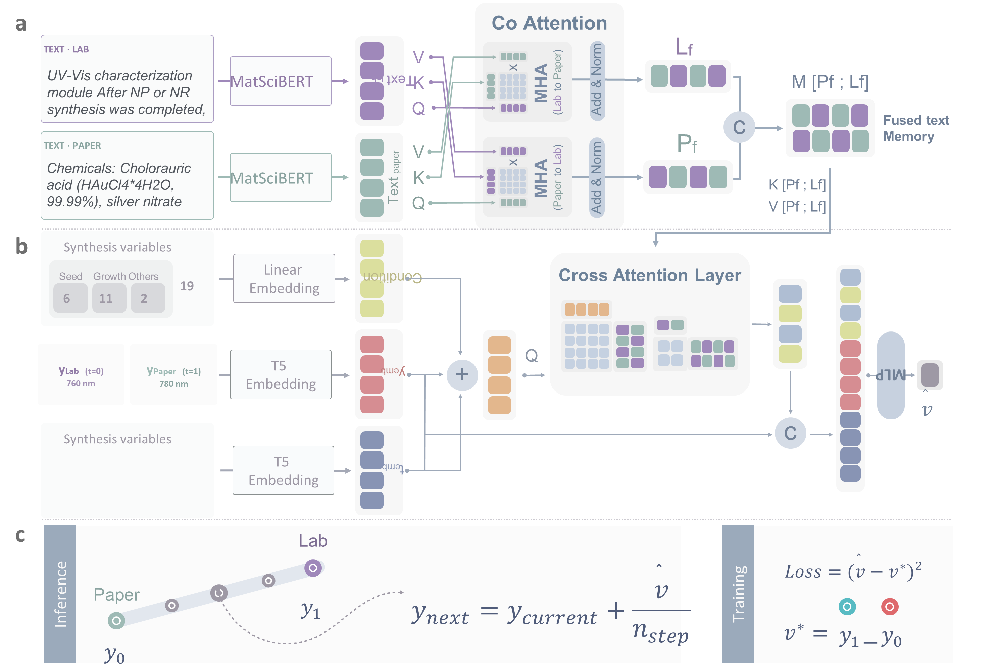

# DATUM

**Domain Alignment Through Unified Multimodal representation**

DATUM aligns nanomaterial synthesis outcomes reported in the literature with measurements obtained from a target laboratory. The framework treats the Methods section of a paper as a functional proxy for missing experimental metadata, and learns a continuous transformation from reported outcomes to laboratory measured outcomes.

This repository contains the model implementation and the baseline models used for comparison.
<p align="center">  </p> <p align="center"> <sub><b>a</b> Bidirectional co-attention between laboratory text and paper text produces a fused text memory. <b>b</b> Cross-attention interprets the fused text memory in the context of the numerical synthesis conditions. <b>c</b> Conditional flow matching transports the reported value toward the measured value.</sub> </p>

---

## Why this exists

Numerically identical synthesis conditions often produce different outcomes in different laboratories. The information that explains the difference is usually written in unstructured procedural text rather than recorded as a structured variable. Aggregating literature derived records therefore does not yield reliable training data for laboratory specific prediction.

DATUM reframes the problem. Instead of proposing a new metadata standard, it uses the procedural language that already exists in published Methods sections, and aligns every record against a common laboratory reference.

---

## Architecture

DATUM has three components, each addressing a distinct representational gap.

| Component | Gap addressed | Mechanism |
|---|---|---|
| Bidirectional co-attention | Cross source linguistic heterogeneity | Paper text and laboratory text attend to each other, producing a fused text memory |
| Cross-attention | Cross modal heterogeneity | Numerical conditions, flow time `t`, and current state `y_t` form queries over the fused text memory |
| Conditional flow matching | Reported to measured transition | A velocity field transports the reported distribution toward the measured distribution |

Training minimizes `MSE(v_pred, v_target)` where `v_target = y_1 - y_0` along the straight line path from the reported value `y_0` to the measured value `y_1`. Inference integrates the learned velocity field from `y_0` with Runge Kutta 4.

---

## Repository structure

```
DATUM/
├── baselines/
│   ├── embedding/           MatSciBERT, SciBERT, Gemma-3, Galactica, OPT
│   ├── condition_only/      numerical conditions only
│   ├── text_only/           procedural text only
│   └── regression_heads/    Ridge, XGBoost, ExtraTrees and other conventional heads
├── datum/
│   ├── 01_coattention/      paper text and laboratory text
│   ├── 02_cross_attention/  fused text memory and numerical conditions
│   ├── 03_cfm/              conditional flow matching head
│   └── model.py             assembles the three components
└── configs/
```

---

## Installation

```bash
git clone https://github.com/<org>/DATUM.git
cd DATUM
pip install -r requirements.txt
```

---

## Quick start

```bash
# Train DATUM
python -m datum.train --config configs/platform1.yaml

# Five fold cross validation
python -m datum.evaluate --config configs/platform1.yaml --cv 5

# Run a baseline for comparison
python -m baselines.condition_only.train --config configs/baseline_condition.yaml
```

---

## Data

The dataset used in this work is hosted separately. Download it from the linked repository and set the path in the configuration file before training.

---

## Citation

```bibtex
@article{datum,
  title   = {Multimodal Flow Matching for Laboratory-Aware Harmonization of
             Multi-Source Nanomaterials Synthesis Data Extracted from the Literature},
  author  = {Nayeon Kim},
  year    = {2026},
  note    = {}
}
```

---

## Contact

Questions and issues are welcome through the GitHub issue tracker.
